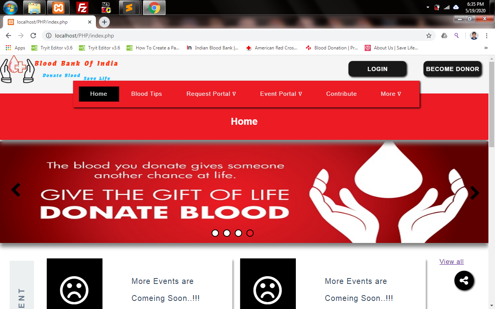
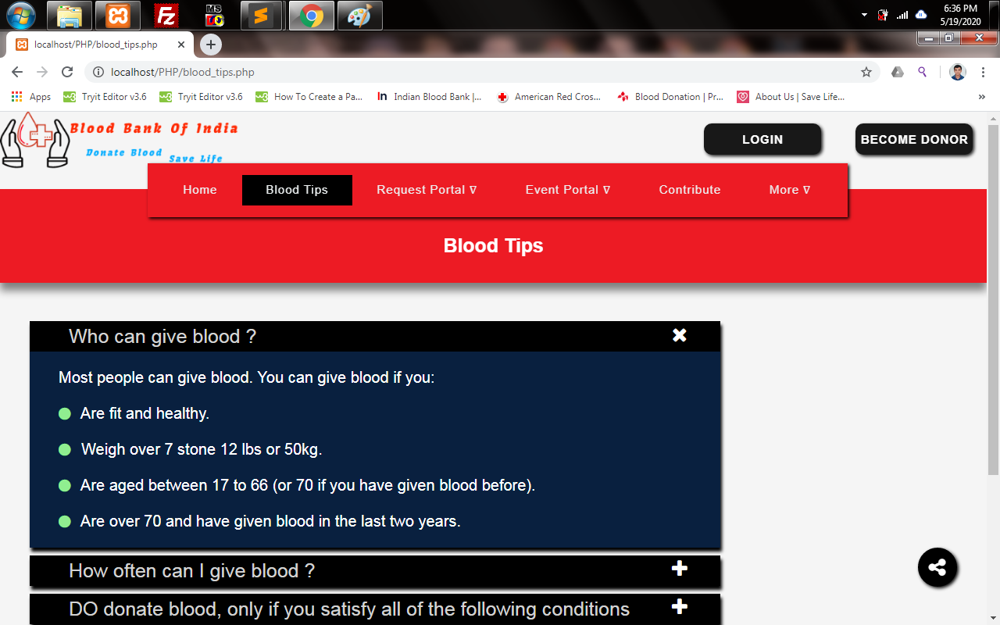
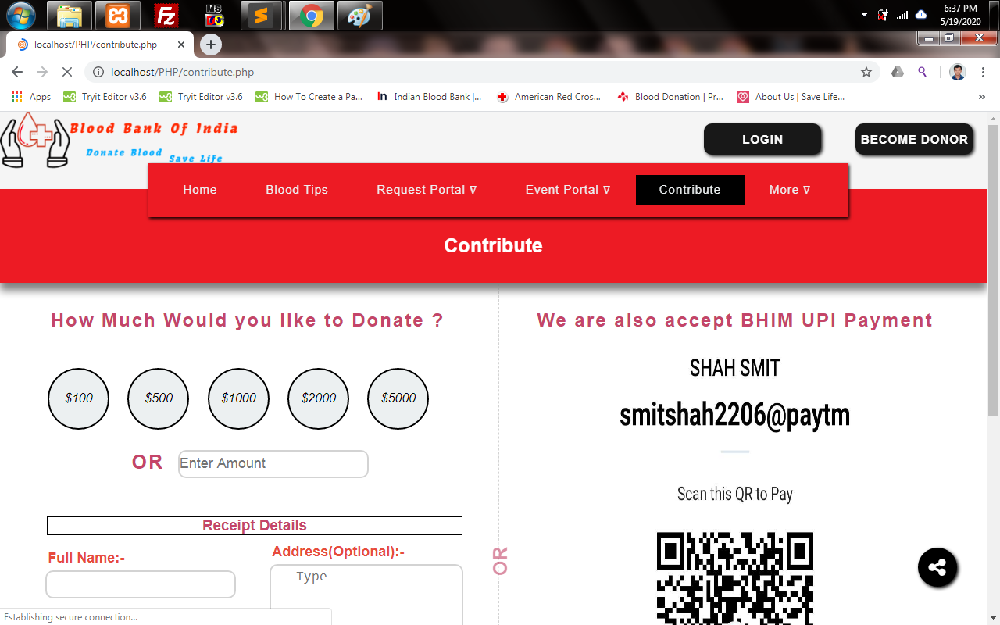
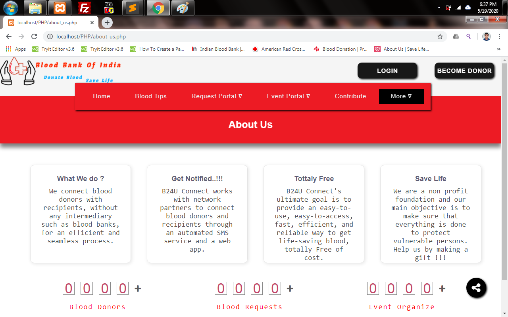

# 🩸 B24U - Blood Donation Management System

[](https://www.php.net/)
[](https://www.mysql.com/)
[](LICENSE)

A comprehensive web-based blood donation management system built with Core PHP, designed to connect blood donors with recipients and facilitate blood donation drives.

## 🎯 Overview

B24U (Blood 24 You) is a web-based platform that aims to create a bridge between blood donors and recipients. The system provides opportunities to register for blood donation, request blood during emergencies, and manage blood donation events efficiently.

### Key Features

- 🏥 **Blood Request System**: Patients can request specific blood types
- 👥 **Donor Management**: Complete donor registration and profile management
- 📅 **Event Management**: Organize and manage blood donation camps
- 📊 **Health Reports**: Track donation history and health reports
- 📧 **Email Notifications**: Automated OTP and notification system
- 🔐 **Secure Authentication**: Separate login systems for donors and event organizers

## 🛠️ Technology Stack

| Technology | Purpose |
|------------|---------|
| **Frontend** | HTML5, CSS3, JavaScript |
| **Backend** | Core PHP |
| **Database** | MySQL |
| **Email** | PHPMailer |
| **Server** | Apache (XAMPP/WAMP) |

## 📋 Prerequisites

Before running this project, ensure you have:

- **XAMPP/WAMP Server** (PHP 7.0+, MySQL 5.7+, Apache)
- **Web Browser** (Chrome, Firefox, Safari, etc.)
- **Text Editor** (VS Code, Sublime Text, Notepad++)

## 🚀 Installation & Setup

### 1. Download and Install XAMPP

```bash
# Download XAMPP from official website
https://www.apachefriends.org/download.html
```

### 2. Clone the Repository

```bash
git clone https://github.com/dhairyadev26/Blood-Donation-PHP.git
```

### 3. Setup Project Files

1. Copy the project folder to XAMPP directory:
   ```
   C:/xampp/htdocs/B24U_CorePHP_SourceFile
   ```

### 4. Database Setup

1. Start XAMPP Control Panel
2. Start **Apache** and **MySQL** services
3. Open browser and navigate to: `http://localhost/phpmyadmin`
4. Create a new database named: `b24u`
5. Import the database:
   - Click **Import** tab
   - Choose file: `Database/b24u.sql`
   - Click **Go**

### 5. Configure Email Settings

1. Navigate to: `B24U_CorePHP_SourceFile/sendemail.php`
2. Update email credentials:

```php
function sendOTP($email,$subject,$body) {
    $sentemail = "your-gmail@gmail.com";    // Your Gmail address
    $sentpassword = "your-app-password";     // Your Gmail app password
    // ... rest of the function
}
```

**Important**: Enable "Less secure app access" or use App Passwords for Gmail.

### 6. Run the Project

1. Start XAMPP services (Apache & MySQL)
2. Open browser and navigate to:
   ```
   http://localhost/B24U_CorePHP_SourceFile
   ```
## 📱 System Modules

### 🏠 Home Page
- Display current donation camps and events
- Show inspirational quotes about blood donation
- Information about platelets and blood donation importance

### 🩸 Blood Tips
- Essential blood donation guidelines
- Pre and post-donation care instructions
- Health tips for donors

### 🆘 Blood Request System
- **Request Blood**: Emergency blood request form
- **Pending Requests**: View all pending blood requests
- Real-time status updates

### 👤 Donor Module
- **Registration**: Complete donor profile creation
- **Login**: Secure donor authentication
- **Dashboard**: Personal donation history
- **Health Reports**: Track health status and eligibility

### 🎪 Event Management
- **Event Registration**: Register blood donation camps
- **Event Login**: Secure access for event organizers
- **Donor List**: View donors participating in events
- **Event Status**: Track event progress and statistics

### 💝 Contribution System
- Monetary donation options
- Support system maintenance
- Community contribution tracking

### ℹ️ About Us
- System information
- Feedback and suggestions
- Contact information

## 🗂️ Project Structure

```
B24U_CorePHP_SourceFile/
├── CSS/                    # Stylesheets
│   ├── styleindex.css
│   ├── styleaboutus.css
│   ├── stylebloodtips.css
│   └── ...
├── Image/                  # Images and assets
│   ├── logo.png
│   ├── i1.jpg - i4.png    # Homepage images
│   └── ...
├── mail/                   # PHPMailer library
│   ├── class.phpmailer.php
│   ├── class.smtp.php
│   └── class.pop3.php
├── connection.php          # Database connection
├── header.php             # Common header
├── footer.php             # Common footer
├── index.php              # Homepage
├── about_us.php           # About page
├── blood_tips.php         # Blood tips page
├── request_blood.php      # Blood request form
├── pending_request.php    # Pending requests
├── registar_donor.php     # Donor registration
├── login_donor.php        # Donor login
├── donor_page.php         # Donor dashboard
├── registar_event.php     # Event registration
├── login_event.php        # Event login
├── event_status.php       # Event management
├── contribute.php         # Donation page
├── get_in_touch.php       # Contact page
├── sendemail.php          # Email functionality
└── process.php            # Form processing
```

## 🔧 Configuration

### Database Configuration
Update `connection.php` with your database credentials:

```php
<?php
$host = "localhost";
$username = "root";
$password = "";
$database = "b24u";

$conn = mysqli_connect($host, $username, $password, $database);
if (!$conn) {
    die("Connection failed: " . mysqli_connect_error());
}
?>
```

### Email Configuration
Configure email settings in `sendemail.php`:

```php
$mail->Host = 'smtp.gmail.com';
$mail->SMTPAuth = true;
$mail->Username = 'your-email@gmail.com';
$mail->Password = 'your-app-password';
$mail->SMTPSecure = 'tls';
$mail->Port = 587;
```

## 📸 Screenshots

| Page | Preview |
|------|---------|
| **Home** |  |
| **Blood Tips** |  |
| **Contribute** |  |
| **About Us** |  |

## 🚨 Troubleshooting

### Common Issues

1. **Database Connection Error**
   - Verify MySQL service is running
   - Check database credentials in `connection.php`
   - Ensure database `b24u` exists

2. **Email Not Working**
   - Enable "Less secure app access" in Gmail
   - Use App Passwords for 2FA enabled accounts
   - Check SMTP settings

3. **Page Not Loading**
   - Verify Apache service is running
   - Check file permissions
   - Ensure correct URL path

## 🤝 Contributing

1. Fork the repository
2. Create a feature branch (`git checkout -b feature/AmazingFeature`)
3. Commit your changes (`git commit -m 'Add some AmazingFeature'`)
4. Push to the branch (`git push origin feature/AmazingFeature`)
5. Open a Pull Request

## 📄 License

This project is licensed under the MIT License - see the [LICENSE](LICENSE) file for details.

## 👨‍💻 Original Author

**Smit Shah**
- Email: smitshah22050602@gmail.com
- Phone: +91 8849364239

## 🙏 Acknowledgments

- Thanks to all blood donors who inspire this project
- PHPMailer library for email functionality
- Bootstrap and CSS frameworks for styling
- The open-source community for continuous support

---

<div align="center">
  <strong>🩸 Save Lives, Donate Blood 🩸</strong>
  <br>
  <em>Every drop counts, every donor matters!</em>
</div>
